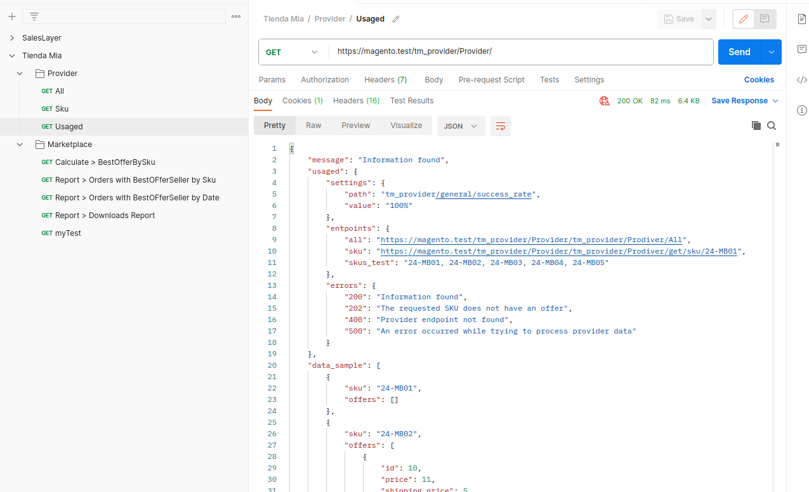
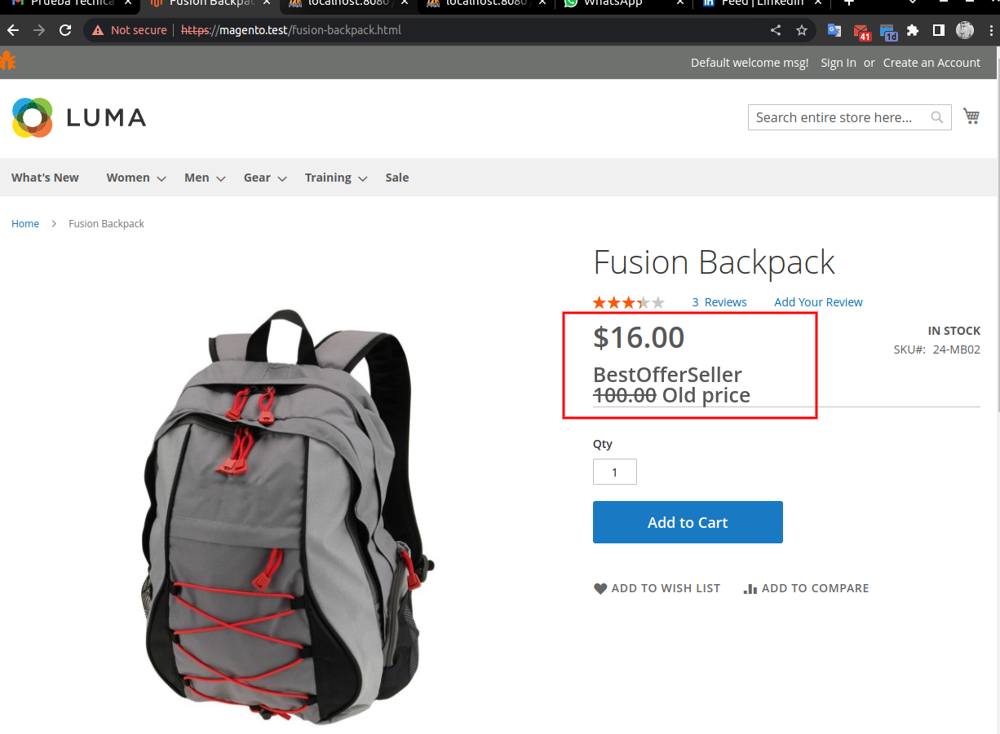
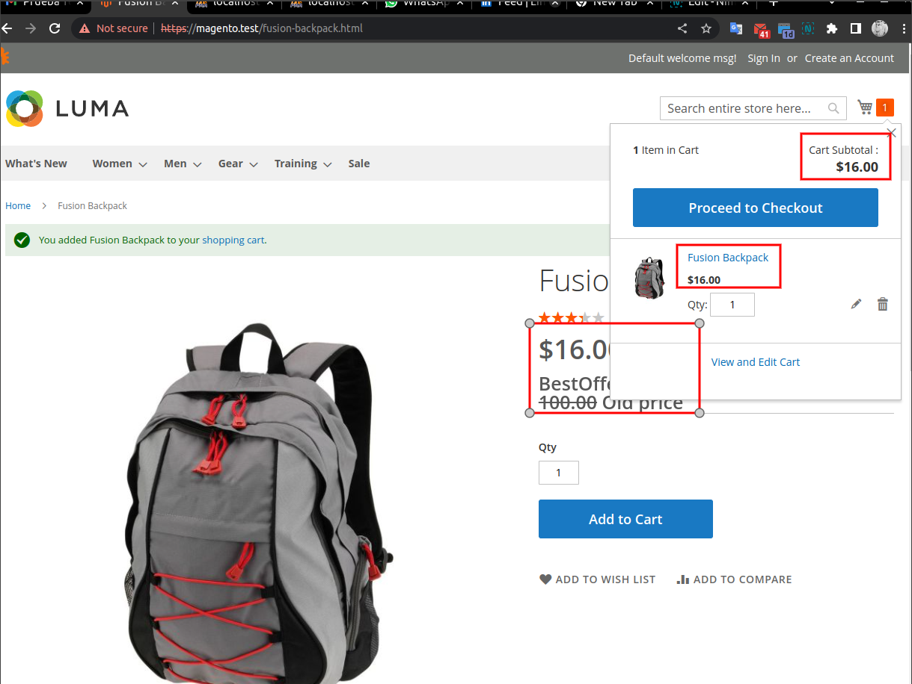
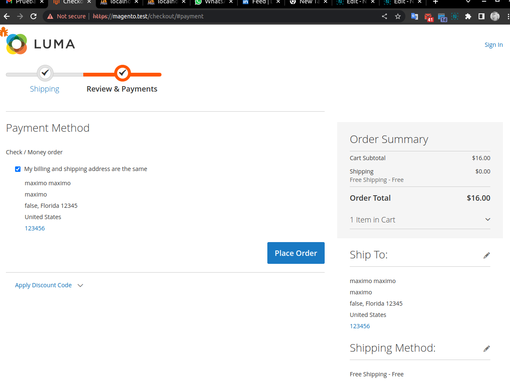
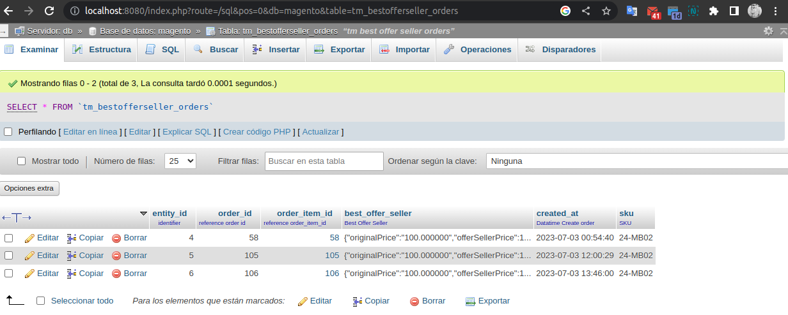
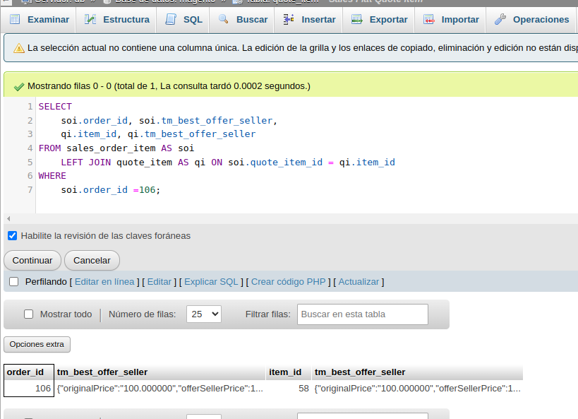
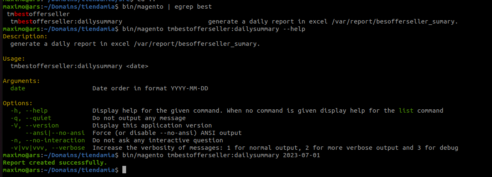

# Tm_BestOfferSeller

## Endpoint collections

Puede utiliza la siguiente coleccion de endpoints

<a href="./docs/endpoints.postman_collection.json" target="_blank">endpoints.postman_collection.json</a>

<a href="./docs/postman_collection.png" target="_blank">

</a>

## Requerimiento implicitos

1. [See](#1) El endpoint del seller puede llegar a falla, debe gestionarse esta condicion.
2. [See](#2) Se debe definir el calculo para determinar la mejor oferta devuelta por el seller.
    1. Solo si la oferta es menor que el precio del producto se debe mostrar al customer en el frontend
3. [See](#3) El nuevo precio debe ser visualizado en PDP, PDL, PDP
    1. En estas page se debe indicar si un precio es por oferta o no
4. [See](#4) El precio debe ser trasladado y visualizado en el frontend en los siguientes procesos.
    1. Add to cart (quote)
    2. Checkout process (sales)
    3. En cada uno de los procesos anteriores se debe guardar la mejor oferta del seller para su trazabilidad (tabla tm_besoffersellers_orders).
5. [See](#5) Es necesario endpoint para comprobar rapidamente que oferta es mejor por sku
6. [See](#6) Es necesario endpoint para obtener ordenes con BestOfferSeller por SKU
7. [See](#7) Es necesario endpoint para obtener ordenes con BestOfferSeller por Date
8. [See](#8) Es necesario endpoint para descargar archivo {date}_bestofferseller.csv por date para sus analisis.
9. [See](#9) CommandLine, debe estar disponible el comando para generar el reporte de ordenes con oferta por dia. Este CLI sera ejecutado con un crontab
10. [See](#10) Considerar translations
11. [See](#11) Para mejorar en cuestion de perfomance se debe crear una tabla con su model, resourcemodel y collection para ser consultada rapidamente.

# Detalle
## 1.

**El endpoint del seller puede llegar a falla, debe gestionarse esta condicion.**

## 2.

**Se debe definir el calculo para determinar la mejor oferta devuelta por el seller.**
El calculo para definir la mejor oferta esta definido en el modelo bajo la siguiente formular

___Se determina el total de ofertas (dos ofertas) **endpoint**__

```sh
  {
    "sku": "24-MB02",
    "offers": [
      {
        "id": 10,
        "price": 11,
        "shipping_price": 5,
        "stock": 100,
        "delivery_date": "2023-10-01",
        "can_be_refunded": true,
        "status": "new",
        "guarantee": true,
        "seller": {
          "name": "Provider-01",
          "qualification": 5,
          "reviews_quantity": 1
        }
      },
      {
        "id": 11,
        "price": 100,
        "shipping_price": 20,
        "stock": 60,
        "delivery_date": "2023-10-01",
        "can_be_refunded": true,
        "status": "new",
        "guarantee": true,
        "seller": {
          "name": "Provider-02",
          "qualification": 2,
          "reviews_quantity": 100
        }
      }
    ]
  },
```

___Se agrupan elementos a evalular por id de oferta **Model/BestOfferSeller::prepareElementToEvaluate()**___

```bash
{
   "price": { "x10": 75, "x11": 50 },
   "stock": { "x10": 100, "x11": 60 },
   "qualification": { "x10": 5, "x11": 2 },
   "reviews_quantity": { "x10": 1, "x11": 100 }
}
```

___Se calcula el score individual, asignado al mejor valor la cantidad maxima de oferta, de forma decreciente. **Model/BestOfferSeller::scorePerElements()**___

Esto quiere decir que en dos ofertas, la que tenga mejor precio tendra un score = 2, y la siguiente score = 1
```bash
{
   "x10": {
       "price": 2,
       "stock": 2,
       "qualification": 2,
       "reviews_quantity": 1
   },
   "x11": {
       "price": 1,
       "stock": 1,
       "qualification": 1,
       "reviews_quantity": 2
   },
}
```

___Se asigna un peso a los elementos evaluados . **Model/BestOfferSeller::getBestOfferId()**___

De esta forma si algun elemento evaluado es igual se consideran los demas 

```bash
$weightPrice          = 0.4; 
$weightQualification  = 0.3; 
$weightReviews        = 0.2; 
$weightStock          = 0.1;

# Obteniendo la mejor oferta
{
   "x10": 1.8, //Best offer!
   "x11": 1.2
}
```

___Luego se obtiene solo el id de la oferta **x10 = 10**. **Model/BestOfferSeller::getBestOfferId()**___

Esto puede ser consultado desde el siguiente endpoint

```bash
https://magento.test/tm_bestoffer/BestOffer/index/sku/:sku

https://magento.test/tm_bestoffer/BestOffer/index/sku/24-MB01
```


## 3.
**El nuevo precio debe ser visualizado en PDP, PDL, PDP**
<a href="./docs/pdp_finalprice.png" target="_blank">

</a>

## 4.

**El precio debe ser trasladado y visualizado en el frontend en los siguientes procesos.**

**1. Add to cart (quote)**

<a href="./docs/cart_quote.png" target="_blank">

</a>

**2. Checkout process (sales)**

<a href="./docs/checkout_process" target="_blank">

</a>

**3. En cada uno de los procesos anteriores se debe guardar la mejor oferta del seller para su trazabilidad (tabla tm_besoffersellers_orders).**

<a href="./docs/table_tm_bestofferseller_orders.png" target="_blank">

</a>

<a href="./docs/table_quote_item_sales_order_item.png" target="_blank">

</a>

```bash
#query
SELECT 
	soi.order_id, soi.tm_best_offer_seller,
    qi.item_id, qi.tm_best_offer_seller
FROM sales_order_item AS soi 
	LEFT JOIN quote_item AS qi ON soi.quote_item_id = qi.item_id
WHERE
	soi.order_id =106;

# quote_item.tm_best_offer_seller
# sales_order_item.tm_best_offer_seller
{
	"originalPrice": "100.000000",
	"offerSellerPrice": 16,
	"dataBestOfferSeller": {
		"id": 10,
		"price": 11,
		"shipping_price": 5,
		"stock": 50,
		"delivery_date": "2023-10-01",
		"can_be_refunded": true,
		"status": "new",
		"guarantee": true,
		"seller": {
			"name": "Provider-01",
			"qualification": 5,
			"reviews_quantity": 1
		}
	}
}
```

## 5.

**Es necesario endpoint para comprobar rapidamente que oferta es mejor por sku**
Recordar que este sku debe estar en la **db** del modulo tm_provider

```bash
https://magento.test/tm_bestoffer/BestOffer/index/sku/:sku

https://magento.test/tm_bestoffer/BestOffer/index/sku/24-MB01
```

```bash
{
    "id": 10,
    "price": 11,
    "shipping_price": 5,
    "stock": 50,
    "delivery_date": "2023-10-01",
    "can_be_refunded": true,
    "status": "new",
    "guarantee": true,
    "seller": {
        "name": "Provider-01",
        "qualification": 5,
        "reviews_quantity": 1
    }
}
```

## 6.

**Es necesario endpoint para obtener ordenes con BestOfferSeller por SKU**

```bash
https://magento.test/tm_bestoffer/reports/index/sku/:sku

https://magento.test/tm_bestoffer/reports/index/sku/24-MB01
```

```bash
[
    {
        "sku": "24-MB02",
        "type": "simple",
        "order_id": "000000005",
        "customer_name": "maximo maximo",
        "state": "new",
        "status": "pending",
        "createdAt": "2023-07-01 10:16",
        "updatedAt": "2023-07-01 10:16",
        "bestOfferSeller": {
            "originalPrice": "100.000000",
            "offerSellerPrice": 16,
            "dataBestOfferSeller": {
                "id": 10,
                "price": 11,
                "shipping_price": 5,
                "stock": 100,
                "delivery_date": "2023-10-01",
                "can_be_refunded": true,
                "status": "new",
                "guarantee": true,
                "seller": {
                    "name": "Provider-01",
                    "qualification": 5,
                    "reviews_quantity": 1
                }
            }
        }
    },
    ...
]
```

## 7.
**Es necesario endpoint para obtener ordenes con BestOfferSeller por Date**

```bash
https://magento.test/tm_bestoffer/reports/index/date/:date

https://magento.test/tm_bestoffer/reports/index/date/2023-07-02
```

```bash
[
    {
        "sku": "24-MB02",
        "type": "simple",
        "order_id": "000000011",
        "customer_name": "MAximo Maximo",
        "state": "new",
        "status": "pending",
        "createdAt": "2023-07-02 19:09",
        "updatedAt": "2023-07-02 19:09",
        "bestOfferSeller": {
            "originalPrice": "100.000000",
            "offerSellerPrice": 16,
            "dataBestOfferSeller": {
                "id": 10,
                "price": 11,
                "shipping_price": 5,
                "stock": 100,
                "delivery_date": "2023-10-01",
                "can_be_refunded": true,
                "status": "new",
                "guarantee": true,
                "seller": {
                    "name": "Provider-01",
                    "qualification": 5,
                    "reviews_quantity": 1
                }
            }
        }
    },
    ...
]
```

## 8.

**Es necesario endpoint para descargar archivo {date}_bestofferseller.csv por date para sus analisis.**

Este endpoint debe ser consultado desde el navegador, para que descargue el archivo

___Se guarda en var/BestOfferSeller/2023-07-01-bestoffersellers_orders.csv___

```bash
https://magento.test/tm_bestoffer/reports/dailysummary/date/:date

https://magento.test/tm_bestoffer/reports/dailysummary/date/2023-07-01
```

See <a href="./docs/2023-07-01bestoffersellers_orders.csv">2023-07-01-bestoffersellers_orders.csv</a>

## 9.

**CommandLine, debe estar disponible el comando para generar el reporte de ordenes con oferta por dia. Este CLI sera ejecutado con un crontab**

```bash
bin/magento tmbestofferseller:dailysummary 2023-07-01
```

<a href="./docs/command_line.png" target="_blank">

</a>


## 10.

**Considerar translations**

No require interaccion con usuarios no tecnicos. se empleo **i18n** en **tm_provider**

## 11.

**Para mejorar en cuestion de perfomance se debe crear una tabla con su model, resourcemodel y collection para ser consultada rapidamente.**

<a href="./docs/table_tm_bestofferseller_orders.png" target="_blank">

</a>


