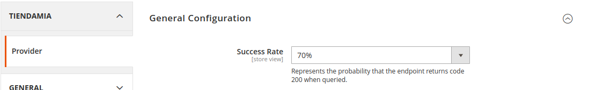

# Tm_Provider 
## Index
- [Resume](#resume)
- [Settings](#settings)
- [Usaged](#Usaged)

## Resume

This module simulates the endpoint query of a provider, where the data to be returned is set in a json file. See [database.json](./Controller/Provider/database.json)

## Settings

In this module you can set the success rate to simulate problems on the endpoint

### Apply Setting

#### From Backend

This can be done from **Backend -> Menu > Stores > Configurations > Tienda Mia > Provider**
<a href="./docs/img/settings_success_rate.png" target="_blank">

</a>

#### From Command Line

You can also configure by CLI

```sh

magento config:set tm_provider/general/success_rate <int from 0 to 100>

magento config:set tm_provider/general/success_rate 10
magento config:set tm_provider/general/success_rate 70
magento config:set tm_provider/general/success_rate 100
```

## Usaged

Once the success rate has been applied and the data in the [../Model/database.json](./Model/database.json) file customized, you can check the result as follows

### Endpoint usage

You can see the information to use the endpoints from

```sh
# Endpoint domain/tm_provider/Provider/
# Response
{
    "message": "Information found",
    "usaged": {
        "settings": {
            "path": "tm_provider/general/success_rate",
            "value": "70%"
        },
        "entpoints": {
            "all": "https://DOMAIN/tm_provider/Provider/tm_provider/Prodiver/All",
            "sku": "https://DOMAIN/tm_provider/Provider/tm_provider/Prodiver/get/sku/24-MB01",
            "skus_test": "24-MB01, 24-MB02, 24-MB03, 24-MB04, 24-MB05"
        },
        "errors": {
            "200": "Information found",
            "202": "The requested SKU does not have an offer",
            "400": "Provider endpoint not found",
            "500": "An error occurred while trying to process provider data"
        }
    },
    "data_sample": [
        {
            "sku": "24-MB01",
            "offers": []
        },
        ....
```

### Endpoint All

This endpoint shows all the available offers of the provider

```sh
# Endpoint domain/tm_provider/Provider/All
# Response
{
    "successRate": "70%",
    "message": "Information found",
    "data": [
        {
            "sku": "24-MB01",
            "offers": []
        },
        {
            "sku": "24-MB02",
            "offers": [
                {
                    "id": 0,
                    "price": 90,
                    "shipping_price": 10,
                    "stock": 57,
                    "delivery_date": "2023-10-01",
                    "can_be_refunded": true,
                    "status": "new",
                    "guarantee": true,
                    "seller": {
                        "name": "Provider-01",
                        "qualification": 5,
                        "reviews_quantity": 100
                    }
                },
                ...
```

### Endpoint Sku

This endpoint shows all the available offers of the provider 

```sh
# Endpoint domain/tm_provider/Provider/get/sku/:SKU
# Response
{
    "successRate": "70%",
    "message": "Information found",
    "data": [
        {
            "sku": "24-MB02",
            "offers": [
                {
                    "id": 0,
                    "price": 90,
                    "shipping_price": 10,
                    "stock": 57,
                    "delivery_date": "2023-10-01",
                    "can_be_refunded": true,
                    "status": "new",
                    "guarantee": true,
                    "seller": {
                        "name": "Provider-01",
                        "qualification": 5,
                        "reviews_quantity": 100
                    }
                },
                ...
```


